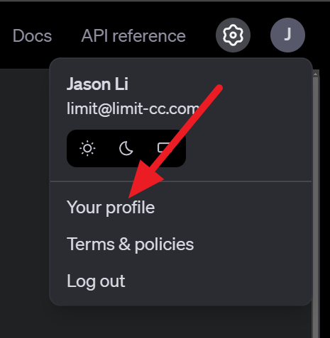

# OpenAI API T2T Component by LCC

## What is this for?
Uses [OpenAI's Python SDK](https://github.com/openai/openai-python) to generate responses from text given your configured model. Also will work with any OpenAI-compatible API.

Examples of compatible providers and servers:
- [OpenAI](https://platform.openai.com/docs/api-reference/models) (obviously)
- [Text generation web UI](https://github.com/oobabooga/text-generation-webui)
- [LM Studio](https://lmstudio.ai)
- [llama-server](https://github.com/ggml-org/llama.cpp?tab=readme-ov-file#llama-server)
- [Ollama](https://ollama.com)


For information on OpenAI's text generation API, visit [their docs](https://platform.openai.com/docs/guides/text-generation).

## Setup

Windows
```
conda create -n jaison-comp-t2t-openai-api python=3.12
conda activate jaison-comp-t2t-openai-api
pip install -r requirements.txt
```

Unix
```
python -m venv venv
source venv/bin/activate
pip install -r requirements.txt
```

Furthermore, create a `.env` file in the root of this project with the following:
```
OPENAI_API_KEY=<openai api key like sk-...>
```
You can find you OpenAI API token [here](https://platform.openai.com/api-keys) as shown below:




If you use a diffenent provider, make sure to set a key as well. Any value is usually ok, if unsure check your LLM server's documentation.

## Testing
Assuming you are in the right virtual environment and are in the root directory:
```
python ./src/main.py --port=5000
```
If it runs, it should be fine.

You also can run the 
```
python ./config-test.py
```
To make sure you did set up .env and json.config right

## Configuration
In `config.json`, update `model` with the model you want to use like `gpt-4o-mini` or `ft:gpt-4o-mini-2024...`. 
Also update `env` with the filepath to your `.env` environment file and use absolute path in to avoid possible problems.  

If you use OpenAI's services, set `base_url` to `https://api.openai.com/v1`. For other providers, check their respective documentation.

Adjust `temperature`, `top_p`, `frequency_penalty`, `presence_penalty` to change variety of responses to your liking.

## Related stuff
Project J.A.I.son: https://github.com/limitcantcode/jaison-core

Join the community Discord: https://discord.gg/Z8yyEzHsYM
